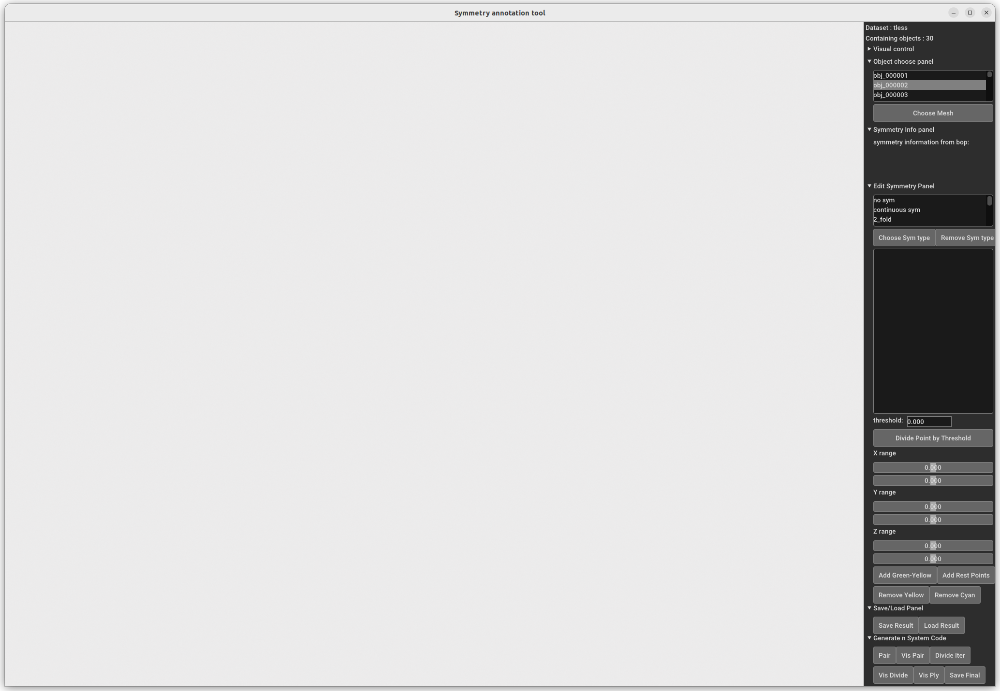
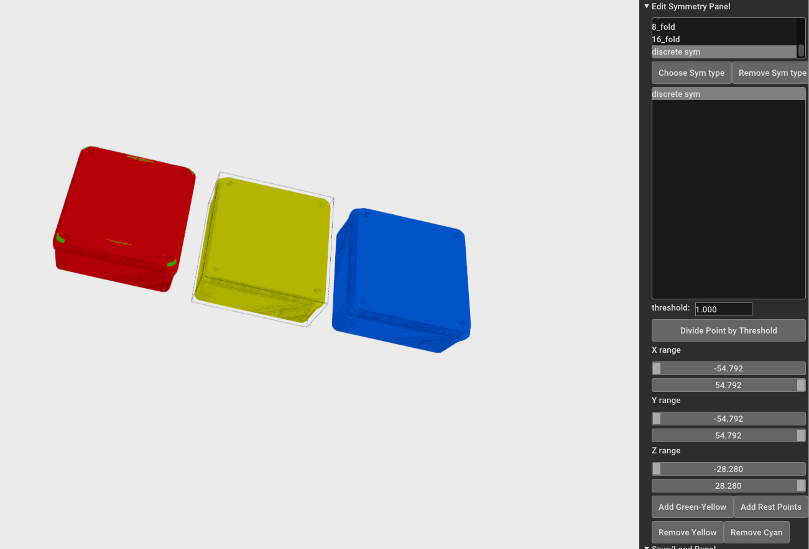
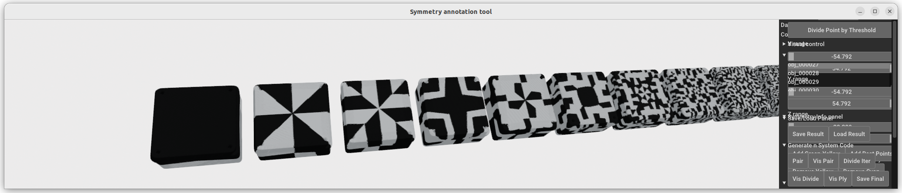
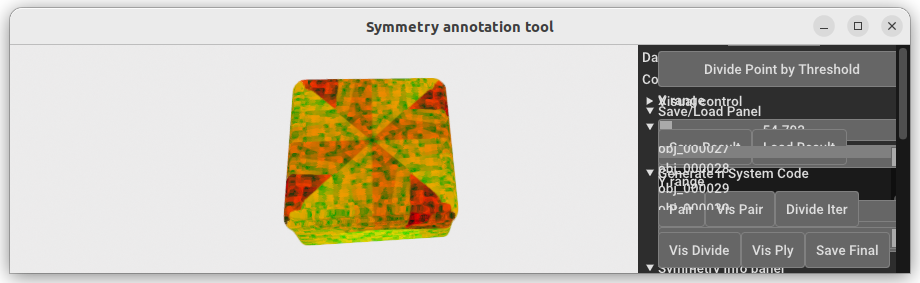

# GT_Generator
Generate Ground Truth Binary Code for SymNet from Scratch.

## Build Conda Environment
Follow these steps to set up the required environment:

```bash
conda create -n code python=3.9 -y
conda activate code

# Install required Python packages
pip install open3d opencv-python pymeshlab==v2022.2 trimesh imageio moderngl

# Clone and install the BOP Toolkit
git clone https://github.com/lyltc1/bop_toolkit.git
cd bop_toolkit
pip install -e .

# Install the code_generator package
cd ..
pip install -e .  # Use the -e flag for editable installation
```
Note: only python 3.9 is tested, higher version of pymeshlab may cause error.

## Prepare Data
Download the dataset from the [BOP benchmark](https://bop.felk.cvut.cz/datasets/).

The expected data structure:
```
code_generator/
├── scripts
├── utils
├── bop_toolkit
├── data/
    ├── bop/
    │   ├── ycbv
    │   ├── tless
    │   └── ...               # other datasets from BOP page
    ├── remesh_visible        # will be generated
    ├── models_GT_color       # will be generated
    └── binary_code           # will be generated
```


## Step 1: Remesh Models
Generate dense point cloud models and save them to the `data/remesh_visible/[dataset]` directory.
``` bash
cd scripts
python surface_samples_remesh_visible.py --dataset tless
```
## Step 2: Generate PLY with GT_color
change the parameter in generate_meshes.py # PARAMETERS. the path and dataset_name
``` bash
cd scripts
python generate_meshes.py 
```

1. **Open the Annotation Tool**
    - You should see the annotation tool opened.
    - 

2. **Load an Object**
    - From the right-side Object choose panel, you can choose an object to load.
    - Click `Choose Mesh` to load the object.
    - The symmetry information will be displayed in the `Symmetry Info Panel`.

3. **Choose Symmetry Type**
    - In the `Edit Symmetry Panel`, you can choose different symmetry types.
    - For example, for `tless-object27`, it only contains `discrete sym`.
      - Choose `discrete sym` in the `Edit Symmetry Panel`.
      - Click `Add Rest Points` to annotate all points as discrete sym.
    - 

4. **Annotate Complex Objects**
    - For more complex objects, use `threshold` and `x/y/z range` to help locate points.

5. **Save and Load Results**
    - Click `Load Result` or `Save Result` to save or load the annotation symmetry type.

6. **Generate Code**
    - Click the following buttons to generate code:
    - `Pair`
        - `Vis Pair`
        - `Divide Iter`
        - `Vis Divide`
            - 
        - `Vis Ply`
            - 
        - `Save Final`, which saves the following files:
            - `code_generator/data/models_GT_color_v3/tless/obj_000027.ply`
            - `code_generator/data/models_GT_color_v3/tless/Class_CorresPoint000027.json`
## Step 3: Generate _GT labels
``` bash
cd scripts
python generate_labels.py --dataset lmo
```
Note: You can specify the `obj_ids` in `generate_labels.py` Line 91 to generate labels for specific objects. For example, `obj_ids = [1, 6, 9]` will only generate labels for object 1, 6, and 9. If you want to generate labels for all objects, set `obj_ids = None`. You can also specify the `data_folder` in `generate_labels.py` Line 92 to change the data folder. For example, `for data_folder in [cfg.test_folder, cfg.train_folder, 'train_pbr']:` will generate labels for the train and test folders, as well as the train_pbr folder. 
``` bash